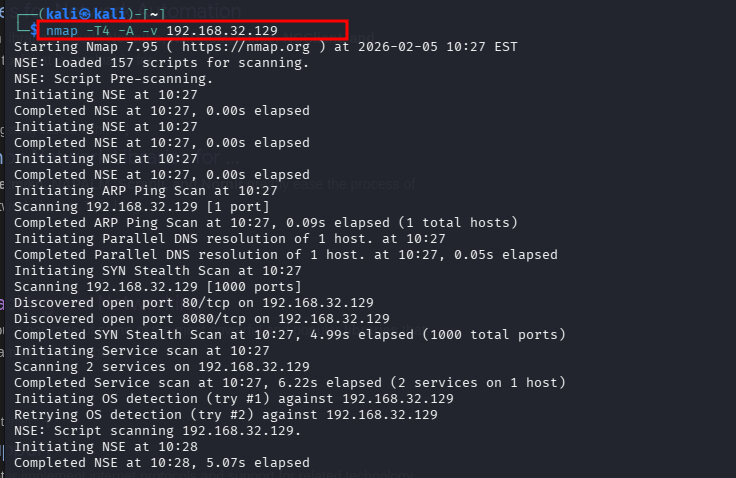
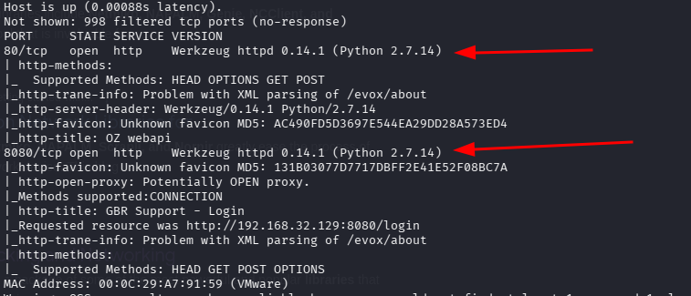

Enumeratios is teh process of finding the possible information that can be used further to get the vulnerability of the machine and it is the most important step.

may be you have to perform this process multiple times and use multiple tools (either online or offline) 

 here i did an aggressive scan 

    you can just use 

        nmap 192.168.32.129 
         it will give you open ports and the services running on it 

         and i did this so that we have more information 

      nmap -T4 -A -v 192.168.32.129
  

  Output i got i this 
  
     

Now we know that two ports are OPEN and we have the services' names  as well.

These are port 80 and 8080 with a  python web server running on it.

